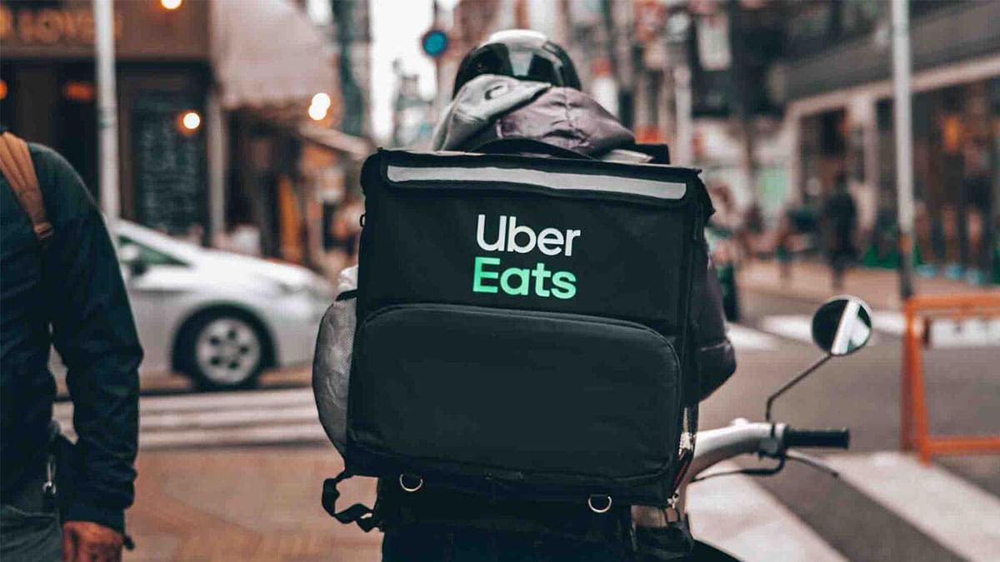

# Uber Eats Food Delivery SPM Concept

This project proposal outlines the creation of a detailed report simulating the conceptualization and development of a food delivery platform similar to Uber Eats. The focus is on the planning, documentation, and organizational processes involved in developing such a platform.

#### Last Updated: June 7th, 2024

## Table of Contents

1. [Overview](#overview)
    - [1.1 Project Summary](#project-summary)
    - [1.1.1 Purpose, Scope, and Objectives](#purpose-scope-objectives)
    - [1.1.2 Assumptions and Constraints](#assumptions-constraints)
    - [1.1.3 Project Deliverables](#project-deliverables)
2. [Project Organization](#project-organization)
    - [4.3 Project Roles and Responsibilities](#project-roles-responsibilities)
3. [Management Process](#management-process)
    - [5.1.1 Estimation](#estimation)
    - [5.2.1 Work Activities](#work-activities)
    - [5.2.2 Schedule Allocation](#schedule-allocation)
    - [5.2.3 Resource Allocation](#resource-allocation)
    - [5.4 Risk Management](#risk-management)
4. [Technical Process](#technical-process)
    - [6.2 Methods, Tools, and Techniques](#methods-tools-techniques)

## Overview

### 1.1 Project Summary

This project aims to simulate the creation of a report detailing the planning and development process for a food delivery platform akin to Uber Eats. The report will cover the conceptualization and planning stages, outlining proposed features, processes, and organizational strategies.

### 1.1.1 Purpose, Scope, and Objectives

**Purpose:**
To replicate the strategic planning behind a food delivery platform like Uber Eats, addressing the need for a seamless connection between customers, restaurants, and delivery drivers, enhancing the overall food ordering experience.

**Scope:**
The scope includes theoretical planning for the following stakeholders:
- **Customers:** Registration, profile management, restaurant browsing, order customization, real-time tracking, and feedback system.
- **Drivers:** Registration, delivery acceptance, tracking, payment processing, and feedback system.
- **Restaurant Owners:** Registration, menu management, order notifications, and coordination with drivers.

**Objectives:**
1. Propose partnerships with various restaurants.
2. Simulate a business model aiming for steady revenue growth.
3. Conceptualize strategies for becoming a leading food delivery platform.
4. Plan to capture a significant market share.
5. Outline strategies for user acquisition and retention.
6. Develop a framework for expanding into new markets.
7. Create a recognizable and strong brand identity.

### 1.1.2 Assumptions and Constraints

**Assumptions:**
1. Reliable internet access for users.
2. Basic familiarity with smartphone or web app usage.
3. Accurate delivery addresses and contact information from customers.
4. Security of account credentials maintained by users.
5. Access to necessary tools for development simulation.
6. Reliable third-party payment gateways and services.

**Constraints:**
1. Accurate and up-to-date personal information required from users.
2. Adherence to payment guidelines and avoidance of fraudulent activities.
3. Unique usernames required for account creation.
4. Compliance with restaurant-specific policies and rules.
5. Following industry best practices for security and data protection.
6. Compliance with local and international regulations and laws.

### 1.1.3 Project Deliverables

We decided what each phase needed to contribute in order to ensure the all requirements for the systems are met in the report before development.

**Analysis Phase:**
- Feasibility Study
- Market Research Report
- Business Requirements Document
- Stakeholder Analysis
- Legal Assessment

**Design Phase:**
- Context Diagram
- Activity Diagram
- Sequence Diagram
- Class Diagram
- Wireframes Design
- GUI Design
- Database Schema Design

**Implementation Phase:**
- Development of Mobile App
- Development of Website
- Database Setup
- Payment Integration

**Testing Phase:**
- Unit Testing
- Integration Testing
- User Acceptance Testing
- Security Testing
- Load Testing

## Project Organization

### 4.3 Project Roles and Responsibilities

We defined roles and responsibilities for project stakeholders including project managers, developers, designers, and testers.

## Management Process

### 5.1.1 Estimation

We created hypothetical estimations that outline the methods used to estimate project timelines, costs, and resources.

### 5.2.1 Work Activities

We create work activities, Work Breakdown Structure (WBS), to describe the key activities involved in the project, including analysis, design, implementation, and testing phases.

### 5.2.2 Schedule Allocation

We proposed schedule based on precedence tables for the overall project as well as detailing timelines for each phase and its deliverables.

### 5.2.3 Resource Allocation

We included details that pertain to the allocation of resources, including personnel, tools, and technology.

### 5.4 Risk Management

In this section we identified potential risks, both generic and specific to each of the main phases, and outline strategies to mitigate them. 

## Technical Process

### 6.2 Methods, Tools, and Techniques

Discuss the proposed methods, tools, and techniques for developing the food delivery platform. Ensure the use of industry best practices and innovative solutions to achieve project objectives.

## Acknowledgement

This project wouldn't have been possible without my dear friends and team mates who helped make it happen. Credit goes to Maximos Ashraf, Mahmoud Hussein and Mostapha Abdulaziz for making it possible. Many thanks to our TA Israa for her unconditional support throughout the various phases of the project writing.